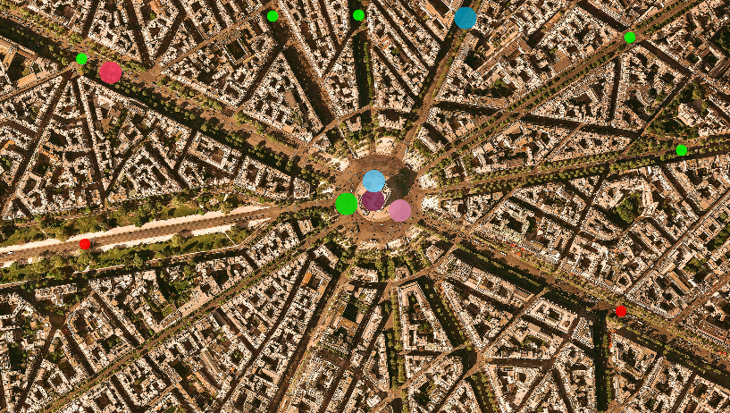
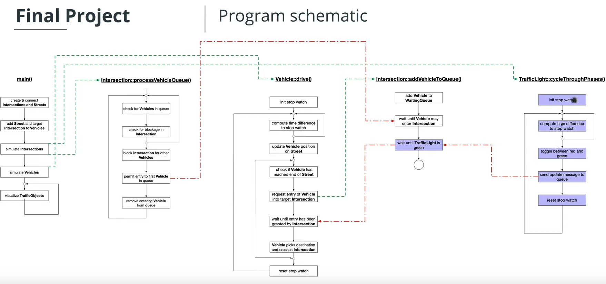

# CPP Traffic Simulator

This is a project from udacity C++ nanodegree program. This project demonstrated how the C++ concurency being used.

## Project Overview

This project is run inside docker. Please look at my other repo like [docker-setup](https://github.com/BruceChanJianLe/docker-setup) and [docker-display-gui](https://github.com/BruceChanJianLe/docker-display-gui).

**Project Schematic**

